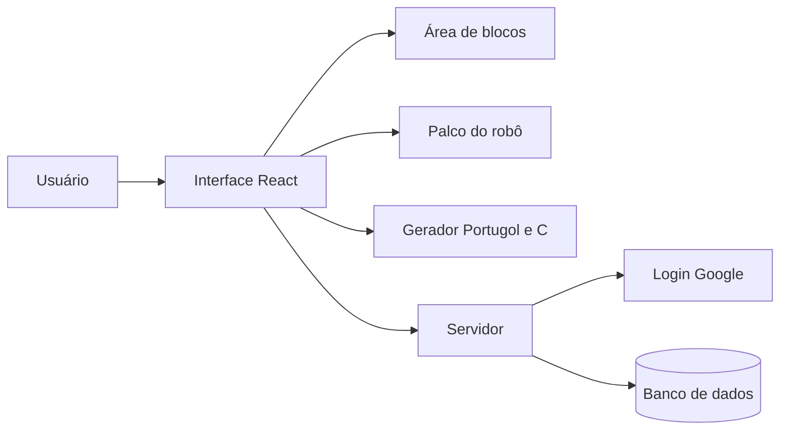

# Arquitetura em alto nível

O usuário usa uma interface web em React, com a área de blocos e o palco do robô. O gerador de código fica junto da interface, então os blocos viram Portugol ou C sem depender do servidor. O servidor cuida de cadastro, login com Google e dos programas salvos, e conversa com o banco de dados.

## Partes do sistema

| Parte | O que faz |
|---|---|
| Área de blocos | Deixa o usuário montar o programa |
| Palco do robô | Mostra o robô andando na tela |
| Gerador de código | Transforma os blocos em Portugol ou C |
| Servidor | Cadastro, login e programas salvos |
| Banco de dados | Guarda usuários e programas |

## Decisões em aberto

- NestJS ou Express no servidor
- Banco relacional ou MongoDB
